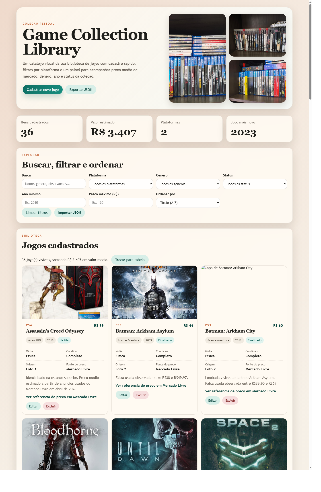
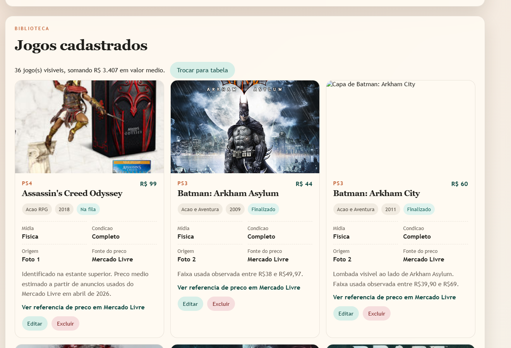

# Game Collection Library

Catalogo pessoal para organizar a colecao de jogos em uma interface simples, bonita e sem banco de dados.

## Preview

Tela inicial com painel, resumo da colecao e filtros:

Area da biblioteca com cards, preco medio e acoes de editar ou excluir:

## O que o site faz

- Mostra um painel com jogos da colecao, usando as fotos da estante como base inicial.
- Permite buscar, filtrar e ordenar por plataforma, genero, status, ano e preco medio.
- Traz um formulario para cadastrar novos itens direto no navegador.
- Quando aberto com o servidor local em `npm start`, salva a colecao em `data/library-games.json` e as novas capas em `assets/covers/`.
- Permite exportar e importar os dados em JSON.

## Arquivos principais

- `index.html`: estrutura do site
- `styles.css`: visual da interface
- `app.js`: logica de filtros, cadastro, persistencia e exportacao
- `server.js`: servidor local para salvar colecao e uploads dentro do projeto
- `data/seed-games.js`: jogos iniciais identificados nas fotos
- `data/library-games.json`: arquivo criado automaticamente com a sua colecao salva

## Como usar

1. Na pasta do projeto, rode `npm start`.
2. Abra `http://127.0.0.1:3000` no navegador.
3. Use o formulario para adicionar ou editar jogos.
4. Quando enviar uma capa nova, o arquivo sera salvo em `assets/covers/`.
5. As alteracoes da colecao ficam persistidas em `data/library-games.json`.

## Observacoes sobre os precos

- Os precos medios iniciais foram estimados com base em pesquisas no Mercado Livre em abril de 2026.
- Como o mercado muda, voce pode editar a base exportando o JSON, ajustando os valores e importando novamente.
