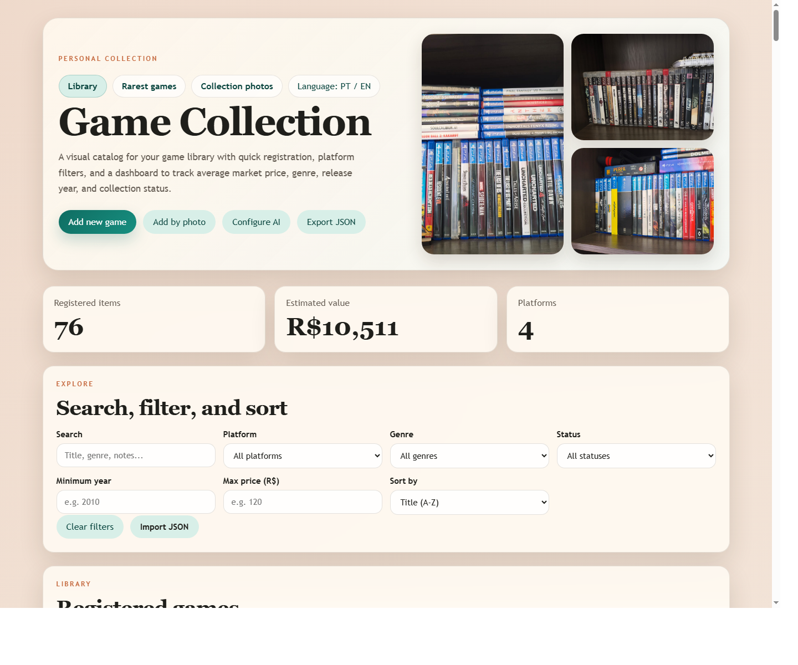
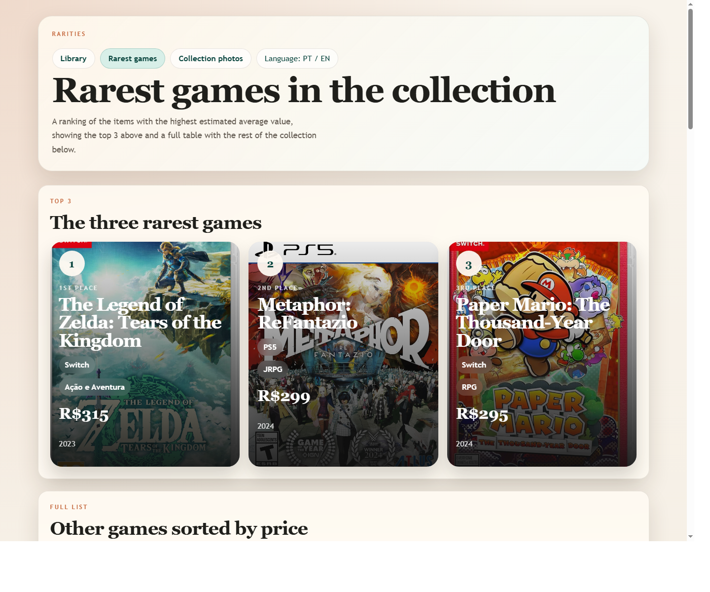
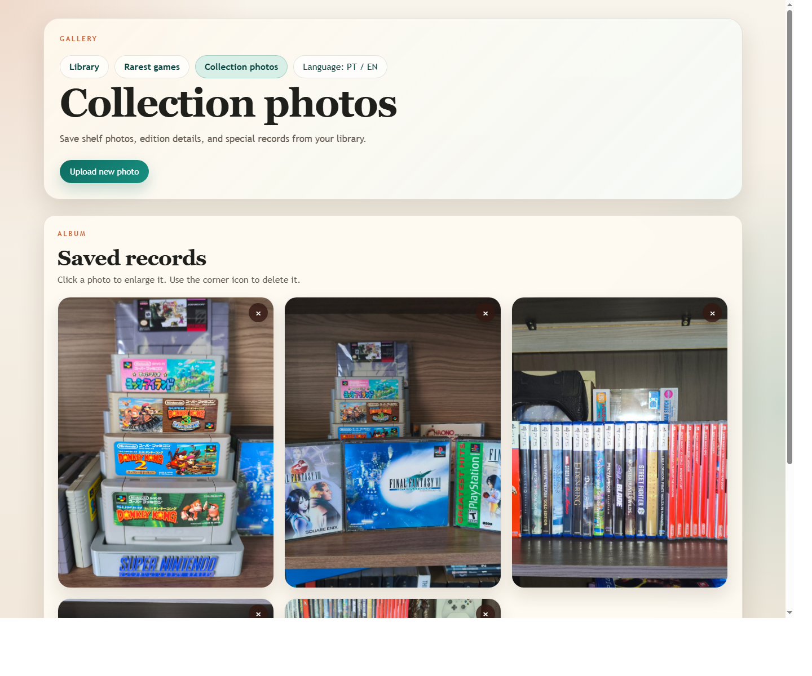

# Game Collection Library

[Português do Brasil](README.pt-BR.md)

A personal catalog for organizing a video game collection with a clean web interface, local project storage, image uploads, filtering, rarity views, and optional AI-assisted photo registration.

## Preview

Library dashboard with search, filters, collection stats, and quick actions:

Rarest games page with a top 3 highlight and a price-sorted list:

Collection photo gallery with upload, zoom, and delete actions:

## Features

- Loads the collection from `data/library-games.json`, keeping the project simple and database-free.
- Lets you search, filter, and sort by platform, genre, status, release year, and average price.
- Supports manual game registration, editing, deletion, and bulk table editing.
- Saves new cover uploads inside `assets/covers/` when running through the local server.
- Includes an AI-assisted photo registration flow that can identify one or more games in the same image.
- Uses a local OpenAI API key file at `.local/openai-key.json`, which is ignored by Git.
- Provides a rarity page ordered by estimated market price.
- Provides a collection gallery stored in `assets/gallery/`, with upload, lightbox zoom, and delete confirmation.
- Supports Portuguese and English in the site UI.
- Exports and imports the collection as JSON.

## Main Files

- `index.html`: main library page structure.
- `styles.css`: visual design and responsive layout.
- `app.js`: library UI, filters, persistence, bulk editing, AI import, and JSON import/export.
- `rare.html` and `rare.js`: rarest games page.
- `gallery.html` and `gallery.js`: collection photo gallery.
- `server.js`: local server used to persist collection data and uploads inside the project.
- `server/storage.js`: file storage helpers for collection, covers, and gallery photos.
- `server/ai.js`: OpenAI integration for photo-based game registration.
- `data/library-games.json`: single source of truth for registered games.

## How To Run

1. Run `npm start` from the project folder.
2. Open `http://127.0.0.1:3000` in your browser.
3. Use the form to add or edit games.
4. Use table mode and `Bulk edit` to update multiple visible games at once.
5. Uploading a new cover saves the file in `assets/covers/`.
6. Use the `Collection photos` page to upload, enlarge, or delete gallery photos.
7. Collection changes are persisted in `data/library-games.json`.

## AI Photo Registration

1. Click `Configure AI`.
2. Paste your OpenAI API key.
3. The key is saved only in `.local/openai-key.json` and is not committed to Git.
4. Click `Add by photo` and select an image containing one or more games.
5. The server uses the photo plus web search to suggest each game's title, platform, genre, year, average price, and official cover image.