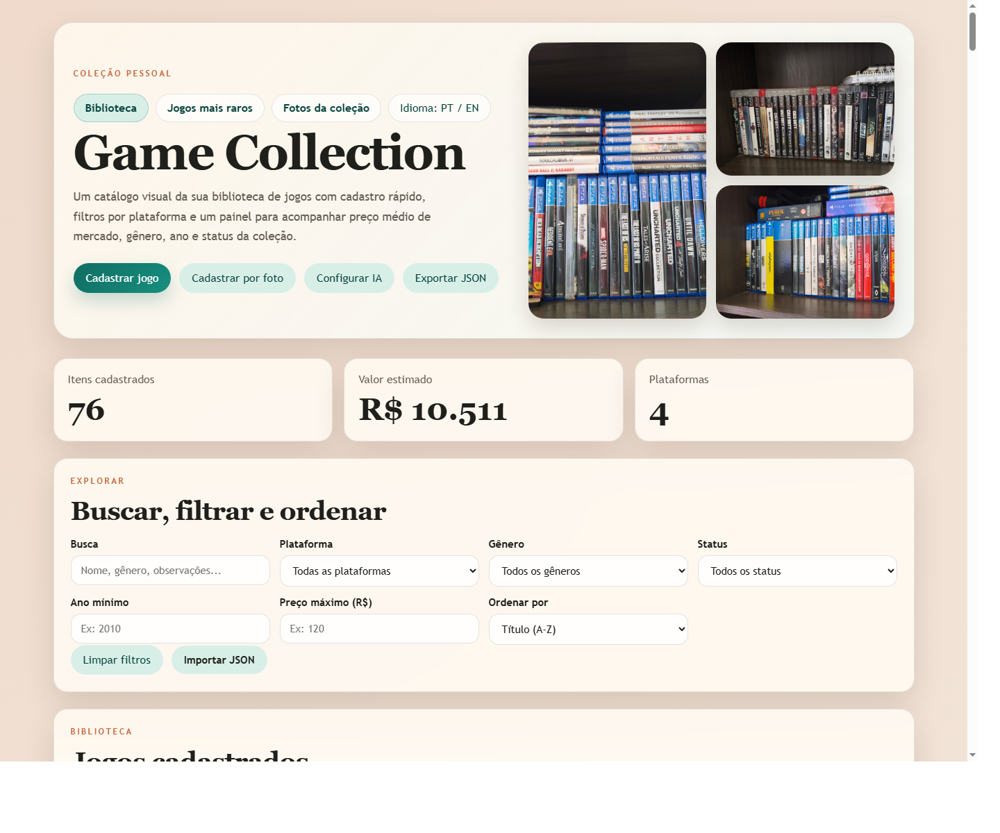
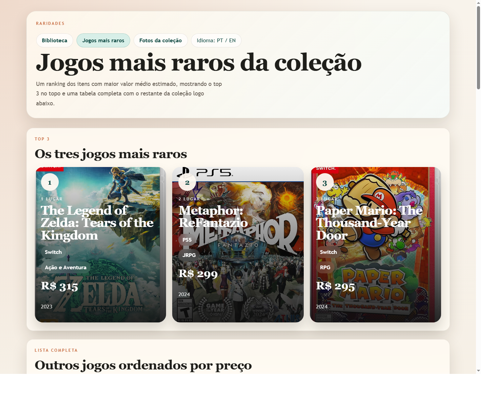
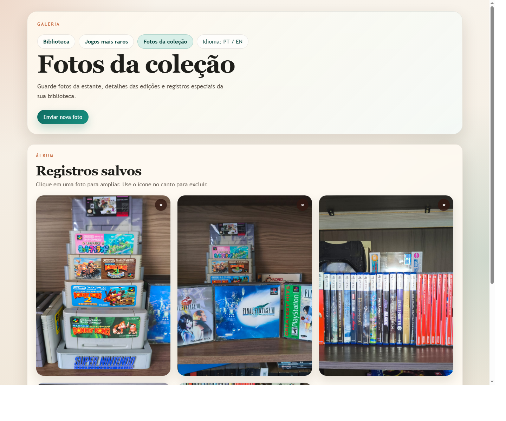

# Game Collection Library

[English](README.md)

Catálogo pessoal para organizar uma coleção de jogos em uma interface web simples, com armazenamento local no projeto, upload de imagens, filtros, página de raridades e cadastro por foto com IA opcional.

## Prévia

Painel da biblioteca com busca, filtros, resumo da coleção e ações rápidas:

Página de jogos mais raros com top 3 em destaque e lista ordenada por preço:

Galeria de fotos da coleção com upload, zoom e exclusão:

## Funcionalidades

- Carrega a coleção a partir de `data/library-games.json`, mantendo o projeto simples e sem banco de dados.
- Permite buscar, filtrar e ordenar por plataforma, gênero, status, ano de lançamento e preço médio.
- Suporta cadastro manual, edição, exclusão e edição em massa no modo tabela.
- Salva novas capas dentro de `assets/covers/` quando o site roda pelo servidor local.
- Inclui cadastro por foto com IA, capaz de identificar um ou mais jogos na mesma imagem.
- Usa uma API key local da OpenAI em `.local/openai-key.json`, arquivo ignorado pelo Git.
- Tem uma página de raridades ordenada pelo preço médio estimado.
- Tem uma galeria de fotos da coleção em `assets/gallery/`, com upload, zoom e confirmação antes de excluir.
- Suporta português e inglês na interface do site.
- Exporta e importa a coleção em JSON.

## Arquivos Principais

- `index.html`: estrutura da página principal da biblioteca.
- `styles.css`: visual da interface e layout responsivo.
- `app.js`: UI da biblioteca, filtros, persistência, edição em massa, importação por IA e importação/exportação JSON.
- `rare.html` e `rare.js`: página de jogos mais raros.
- `gallery.html` e `gallery.js`: galeria de fotos da coleção.
- `server.js`: servidor local usado para persistir dados e uploads dentro do projeto.
- `server/storage.js`: helpers de armazenamento para coleção, capas e fotos da galeria.
- `server/ai.js`: integração com OpenAI para cadastro de jogos por foto.
- `data/library-games.json`: fonte única dos jogos cadastrados.

## Como Rodar

1. Rode `npm start` na pasta do projeto.
2. Abra `http://127.0.0.1:3000` no navegador.
3. Use o formulário para adicionar ou editar jogos.
4. Use o modo tabela e `Editar em massa` para atualizar vários jogos visíveis de uma vez.
5. Ao enviar uma capa nova, o arquivo será salvo em `assets/covers/`.
6. Use a página `Fotos da coleção` para enviar, ampliar ou excluir fotos da galeria.
7. As alterações da coleção ficam persistidas em `data/library-games.json`.

## Cadastro Por Foto Com IA

1. Clique em `Configurar IA`.
2. Cole sua API key da OpenAI.
3. A chave será salva apenas em `.local/openai-key.json` e não será enviada ao Git.
4. Clique em `Cadastrar por foto` e selecione uma imagem com um ou mais jogos.
5. O servidor usa a foto e busca web para sugerir título, plataforma, gênero, ano, preço médio e capa oficial de cada jogo identificado.

## Observações Sobre Preços

- Os preços médios iniciais foram estimados com base em pesquisas no mercado brasileiro, principalmente Mercado Livre, por volta de abril de 2026.
- Como o mercado muda com o tempo, os valores podem ser editados pelo site ou diretamente em `data/library-games.json`.
